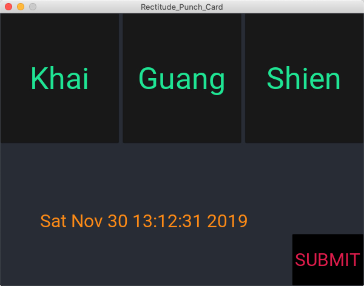
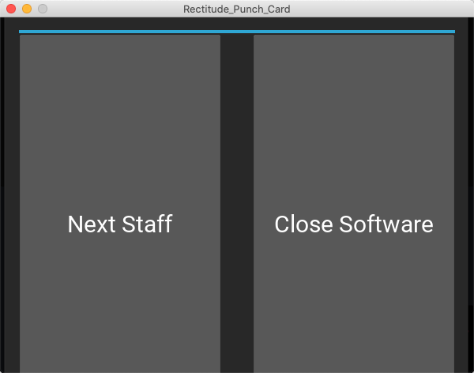
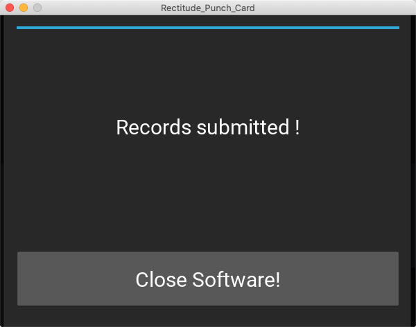

# Punch card system for stores of Rectitude pte ltd

## Main features

The staff can register attendance by clicking his name.
The staff can submit monthly records to the admin by email.

- The first register is 'in'
- From the second register onward, it's 'out'.
- If multiple punches recorded, only the last punch is valid. Although all the activities will be recorded.
  
The punch records are stored in CSV file, the file name is the staff's Name.

A 'submit' button is located at the corner of this programme, the button could send records to the admin's email.

*users.txt* contains the staffs' name of a branch. The code is design for 3 users only. Refer to the comment in the *Rectitude_Punch_Card.py* to add more users.

## Dependency

The programme is build on **Kivy**, a python GUI library. Visit https://kivy.org/#home for more information.

## How to use

set up your personal file to store Email SMTP, user name, password, the receivers.
amend the file path in *sendEmail.py* in *get_email_info()*

### home page

### click name to record

### submit records

